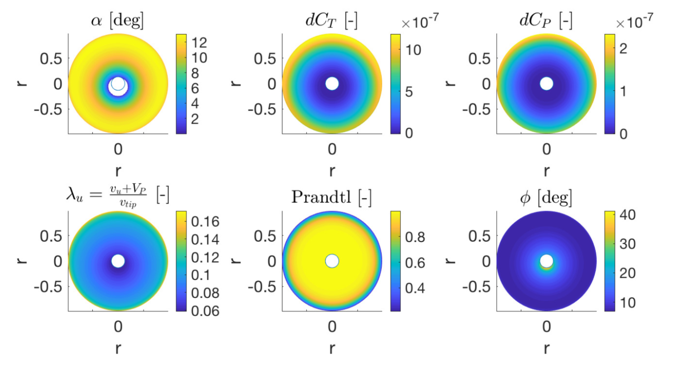
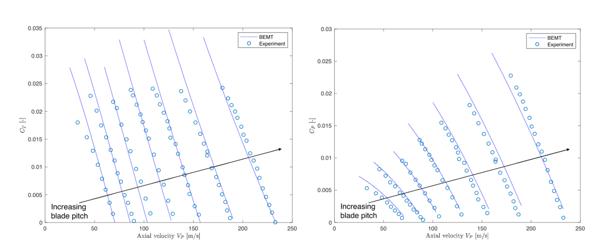

# Aeroacoustic Design Tool for Single/Coaxial Rotors

## Summary
This tool will allow you to assess the performance of a single or a coaxial rotor (in fact, an arbitrary amount of rotors stacked on top of each other) based on a variety of rotor, atmospheric and observer parameters. Examples of such inputs are blade number, rotor radius, rotational speed, root and tip chord, cyclic input, blade twist, lift and drag polars, temperature, kinematic viscosity, observer angle, etc. In **less than a a quarter of a second** the tool will have converged the flow around the rotors and return a full aerodynamic analysis including lift, drag and inflow distributions across the disk along with total power, torque, hub moments and thrust figures. In a few seconds (< 5s), you will obtain a prediction of the noise harmonics and a frequency-weighed decibel value (dBA) as perceived by the observer. 

## Applications
The speed of the tool enables the user to run it in an optimization loop (e.g. a genetic algorithm) where several of these parameters can be optimized with respect to a certain cost function which can be a function of the outputs of the tool (e.g. propulsive efficiency). This tool can also be used to simulate the dynamics of a coaxial rotor or helicopter and even in Model Predictive Control applications.

## Validation and supporting documentation

The tool has been validated against experiments done in literature on standard single and coaxial rotors in a variety of operating conditions. It is the implementation of the following paper (written by the author of the tool), which describes the theory and physics behind the code. Every plot in this paper has been created by the code in this repository.

## Code Structure

The folder `Airfoil_Data` contains lift, drag and moment vs angle-of-attack curves for different airfoils at a fixed Reynolds number. They serve as lookup tables for the tool when `method = 'airfoil'` which can provide more accurate results but at a computational cost.

The folder `Validation_Data` contains experimental measurements from wind-tunnel tests on different rotors which are used to validate the tool.

The folder `src` contains all the MATLAB source code. Within this folder there's a folder called `Unified_BEMT` which stands for Unified Blade Element and Momentum Theory which implements the equations derived in the *Appendix B* of the article (in a numerical fashion, by taking advantage of MATLAB's enhanced perfomance in matrix computation) as well as the acoustic equations presented in *Method B: Acoustic Model*. The code is granularized into small function blocks which represent simple and repetitive steps in the iterative process of flow convergence. These helper methods are located inside `src/Unified_BEMT/Helpers` and are accompanied by documentation.

## Running the tool

1. Install MATLAB (recommended version > 2018a).
2. Enter the input parameters you desire in the `Rotor.m`, `Atmosphere.m` and `Observer.m` files. You can alternatively do this in `main.m`.
3. Open `main.m` and run whatever section you desire (sections are separated by %%). For instance, you can run the *%% Init* section to load all input parameters into the workspace. The table below shows a few more examples of the expected results when running a couple of sections. Feel free to try for yourself!

%% Testing (with `plots = true`)
 
 

%% Axial flight plots
 
  

4. Create your own section and use the `BEMT` and `SpinRotor` methods to create custom plots or design your rotor!
